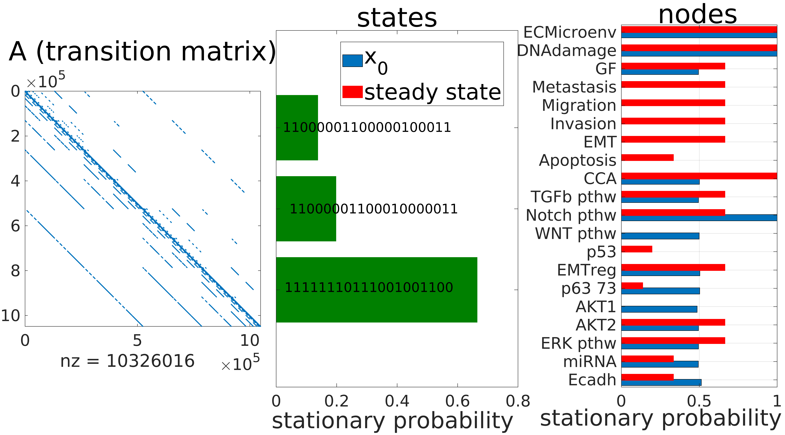
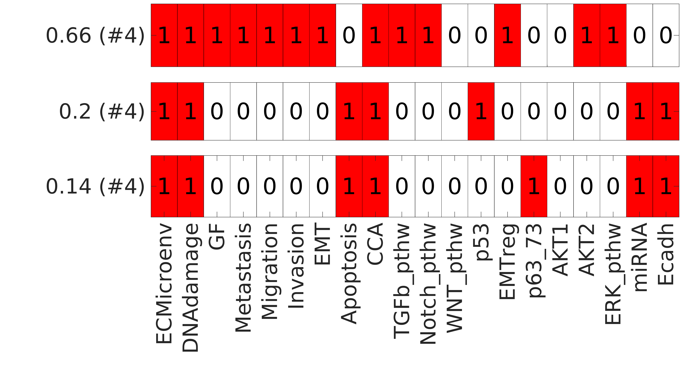
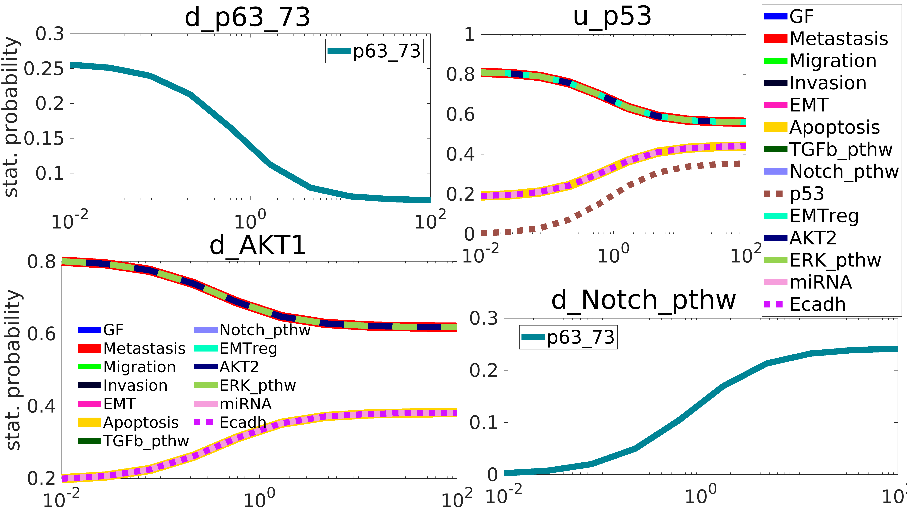
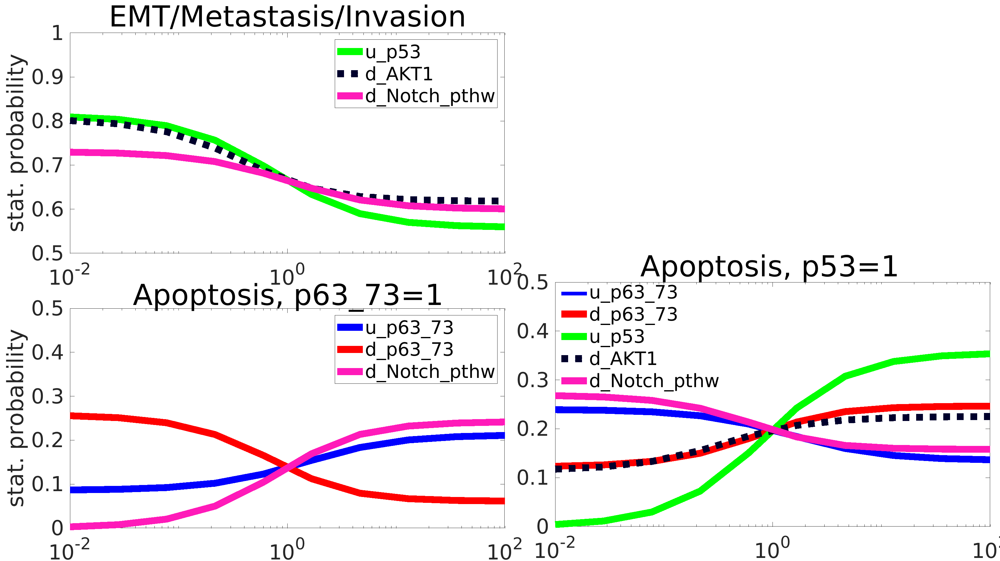
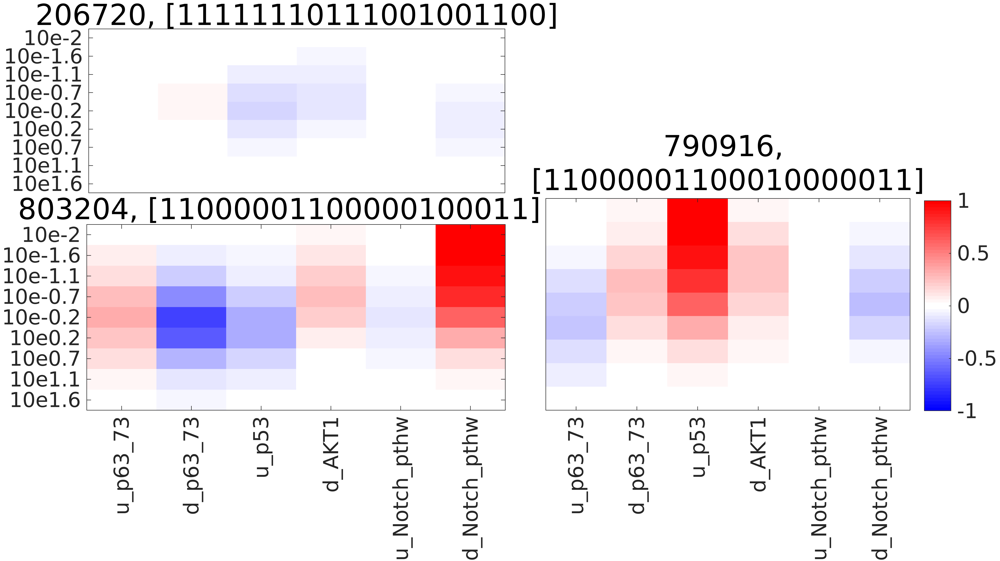
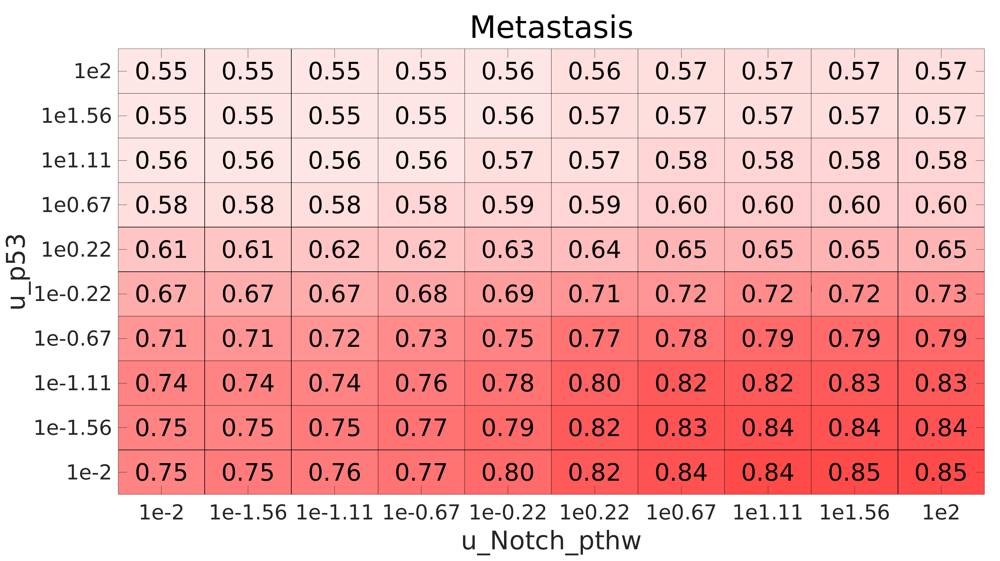
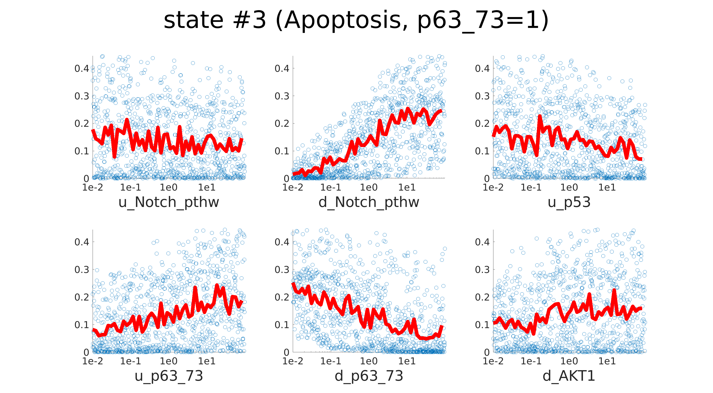
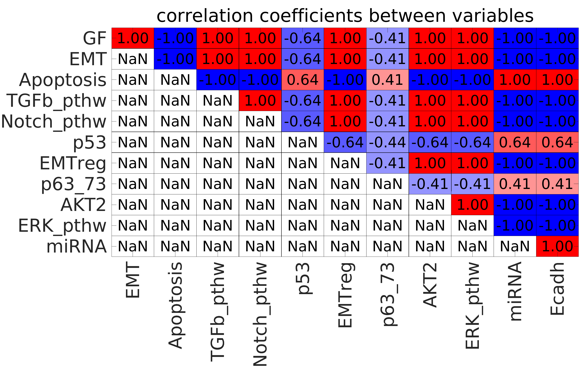

# Tutorial for ExaStoLog: Exact calculation of stationary states + parameter analysis & fitting of stochastic logical models

## Table of contents

1. [Requirements](#1-requirements)
1. [Model creation](#2-model-creation)
      1. [Defining variables and logical rules](#defining-nodes-and-logical-rules)
      1. [Creating the state transition graph](#creating-the-state-transition-graph)
      1. [Defining transition rates](#defining-transition-rates)
      1. [Creating the transition matrix](#creating-the-transition-matrix)
      1. [Defining initial conditions](#defining-initial-conditions)
1. [Calculation of stationary solution](#3-calculation-of-stationary-solution)
1. [Visualizing the stationary solution](#4-visualizing-the-stationary-solution)
      1. [Visualize stationary probability values for states and nodes](#visualize-stationary-probability-values-for-states-and-nodes)
      1. [Visualize binary heatmap of nonzero stationary states](#visualize-binary-heatmap-of-nonzero-stationary-states)
1. [One-dimensional parameter sensitivity analysis](#5-one-dimensional-parameter-sensitivity-analysis)
1. [Multi-dimensional parameter sensitivity analysis](#6-multi-dimensional-parameter-sensitivity-analysis)
      1. [Multidimensional parameter scanning with regular grids](#multidimensional-parameter-scanning-with-regular-grids)
	  1. [Multidimensional parameter scanning with Latin Hypercube Sampling](#multidimensional-parameter-scanning-with-latin-hypercube-sampling)
	  1. [Visualize LHS by scatter plots](#visualize-multi-dimensional-parameter-scans-by-scatter-plots)
      1. [Correlations between model variables](#correlations-between-model-variables)
      1. [Regression of variables by transition rates](#regression-of-variables-by-transition-rates)
      1. [Sobol total sensitivity index](#sobol-total-sensitivity-index)
1. [Parameter fitting](#7-parameter-fitting)

<!--- The steps below are also available and directly executable in [this MATLAB live script](./wrapper.mlx).  --->


### 1. Prerequisites

##### - MATLAB version 2015b or later. (Tested in MATLAB 2015b, 2018b, 2019a.)

##### - clone the [repository](https://github.com/mbkoltai/exact-stoch-log-mod) and enter the directory

##### - unzip the file 'toolboxes.zip' for the external MATLAB libraries used:

- [Customizable heatmaps](https://mathworks.com/matlabcentral/fileexchange/24253-customizable-heat-maps)  

- [Redblue colormap](https://mathworks.com/matlabcentral/fileexchange/25536-red-blue-colormap)  

- [tight subplots](https://mathworks.com/matlabcentral/fileexchange/27991-tight_subplot-nh-nw-gap-marg_h-marg_w) (for subplots with smaller gaps)  

- [export_fig](https://mathworks.com/matlabcentral/fileexchange/23629-export_fig) (export figures as EPS or PDF as they appear on screen)  

- [Simulated annealing](https://mathworks.com/matlabcentral/fileexchange/10548-general-simulated-annealing-algorithm) (parameter fitting by simulated annealing; the script was modified by author to output convergence process)  

- [distinguishable_colors](https://www.mathworks.com/matlabcentral/fileexchange/29702-generate-maximally-perceptually-distinct-colors)

##### - add the folders to the path by typing 'add_functions'

##### The steps below are also contained in the MATLAB file *wrapper.m*, with more options.

### 2. Model creation

#### Defining nodes and logical rules

Models can be defined by entering the list of nodes and their corresponding rules as a cell of strings, using MATLAB logical notation ('&', '|', '~', '(', ')'), or by providing the path to a BoolNet file.
We provide below the names of the models we analyzed in the paper and select the EMT model (Cohen et al 2015) to be read in by the function *fcn_bnet_readin*, also specifying a folder to save plots to:


```MATLAB
model_name_list = {'mammalian_cc', ...
'krasmodel15vars', ...
'breast_cancer_zanudo2017'....
'EMT_cohen_ModNet',...
'sahin_breast_cancer_refined'}; %
% name of the model
model_index=4;
model_name=model_name_list{model_index};

% model read in from BOOLNET file
[nodes,rules]=fcn_bnet_readin(strcat('model_files/',model_name,'.bnet'));

% where to save figures
plot_save_folder=strcat('doc/sample_plots/',model_name,'/');
```

Check if all variables referred to by rules are found in the list of nodes:
```MATLAB
fcn_nodes_rules_cmp(nodes,rules)
```

If the BOOLNET file is not consistent in terms of its nodes and rules, this function displays an error message, otherwise prints *Model seems correct: all elements in rules found in nodes list*.

To create the logical model we need to generate a function file:
```MATLAB
truth_table_filename='fcn_truthtable.m';
fcn_write_logicrules(nodes,rules,truth_table_filename)
```
#### Creating the state transition graph

From this function file we generate the state transition graph (STG) of the logical model. This step (it can take a few seconds) is independent of the values of transition rates, so needs to be done only once for a given model:
```MATLAB
tic; stg_table=fcn_build_stg_table(truth_table_filename,nodes); toc
```

We can check the density of the STG by dividing the number of actual transitions by that of all possible transitions, for the EMT model this is 8.4e-06:
```MATLAB
size(stg_table,1)/(2^(2*numel(nodes)))
```

#### Defining transition rates

To calculate the stationary states of a model we need to assign values to the *2xn* (n=number of nodes) transition rates of the model.

We can select a subset of the transition rates to have a specific value by their names, which is always comprised of *d_* or *u_* and the name of the respective node, and also define the vector of values we want them to have.
For example we can write: *chosen_rates={'u_p53','d_AKT1'};  chosen_rates_vals=[0.25, 0.15];*
We can leave both variables empty to have uniform values:
```MATLAB
chosen_rates=[]; chosen_rates_vals=[];
```

Next we call the function to generate the table of transition rates. We need to select if we want to have the rates to have a uniform value or to be sampled from a normal distribution, in the latter case specify the mean and standard distribution:
```MATLAB
% ARGUMENTS
distr_type={'uniform','random'}; % <uniform> assigns a value of 1 to all params. <random> samples from a lognormal distribution
meanval=[]; sd_val=[]; % if 'random' is chosen, the mean and standard dev of a normal distrib has to be defined
transition_rates_table=fcn_trans_rates_table(nodes,distr_type{1},meanval,sd_val,chosen_rates,chosen_rates_vals);
```

#### Creating the transition matrix

Now we can build the transition matrix of the model with the specified transition rates:
```MATLAB
[A_sparse,~]=fcn_build_trans_matr(stg_table,transition_rates_table,'');
```

For the subsequent calculations only the transition matrix *A* is needed as a variable (it is converted to the kinetic matrix within functions), if we want to have the kinetic matrix *K* as a variable (*dp(t)/dt=Kp(t)*, as opposed to *p(t+1)=p(t)A*), then run the function as:
```MATLAB
[A_sparse,K_sparse]=fcn_build_trans_matr(stg_table,transition_rates_table,'kinetic');
```
We can visualize the transition matrix by:
```MATLAB
spy(A_sparse);
xlabel('model states'); ylabel('model states'); set(gca,'FontSize',24)
```
Check the size of the largest objects that we've generated:
```MATLAB
size_limit_mb=1; fcn_objects_memory_size(whos,size_limit_mb)
```

#### Defining initial conditions

We define an initial condition by specifying a given state we want to have a larger than random (there are 2^n states in total) probability.
To do this we select the nodes we want to have defined values and the total (summed) probability of the states which satisfy the defined condition.
For the analyyzed models we provide a number of initial conditions that are biologically interesting:

```MATLAB
% selected nodes for inital conditions
initial_fixed_nodes_list={ {'CycE','CycA','CycB','Cdh1','Rb_b1','Rb_b2','p27_b1','p27_b2'}, ... % mammalian_cc
 {'cc','KRAS','DSB','cell_death'}, ... % krasmodel15vars
 {'Alpelisib', 'Everolimus','PIM','Proliferation','Apoptosis'},...  % breast_cancer_zanudo2017
 {'ECMicroenv','DNAdamage','Metastasis','Migration','Invasion','EMT','Apoptosis','Notch_pthw','p53'}, ... % EMT_cohen_ModNet
 {'EGF','ERBB1','ERBB2','ERBB3','p21','p27'}}; % sahin_breast_cancer_refined

% values for selected nodes
initial_fixed_nodes_vals_list = {[0 0 0 1 1 1 1 1], ... % mammalian_cc
            [1 1 1 0], ... % krasmodel15vars: [1 1] is cell cycle ON, KRAS mutation ON
            [0 1 0 zeros(1,2)],...  % breast_cancer_zanudo2017
            [1 1 zeros(1,5) 1 0],... % EMT-Cohen model: [0/1 0/1 zeros(1,5)]
            [1 0 0 0 1 1]}; % 1 zeros(1,numel(initial_fixed_nodes_list{model_index})-3) 1 1


% select the initial condition for the model we are working on
initial_fixed_nodes=initial_fixed_nodes_list{model_index}; initial_fixed_nodes_vals=initial_fixed_nodes_vals_list{model_index};
```

Then with the function *fcn_define_initial_states* we assign the probability *dom_prob* among the selected states, and the remainging *1-dom_prob* probability is either uniformly or randomly distributed among the other possible states
```MATLAB
dom_prob=1;
% if <random> the probability is randomly distributed among states, if <uniform> uniformly
distrib_types={'random','uniform'};
% if plot_flag non-empty, we get a bar plot of initial values
plot_flag='';
% function assigns a probability of <dom_prob> to the states with the fixed nodes having the defined values
x0=fcn_define_initial_states(initial_fixed_nodes,initial_fixed_nodes_vals,dom_prob,nodes,distrib_types{1},plot_flag);
```
If \<plot_flag> is non-empty we also get a bar plot of the initial states.

We can also define a completely random or uniform probability distribution of initial states:
```MATLAB
% random
x0=zeros(2^n_nodes,1); x0=rand(2^numel(nodes),1); x0=x0/sum(x0);
% uniform
x0=ones(2^numel(nodes),1)/(2^numel(nodes));
```

### 3. Calculation of stationary solution

Topological sorting of the STG is a parameter-independent step that we need to perform only once for a model (except if we set transition rates to 0, or change the initial condition), so we do it before the calculation of the solution:
```MATLAB
stg_sorting_cell=fcn_scc_subgraphs(A_sparse,x0);
```
This function outputs its progress and shows how many cycles the STG contains, in the case of the EMT model the calculation is 9 seconds (on a CENTOS computer with 8 cores (Intel(R) Xeon(R) CPU X5472 \@ 3.00GHz) and we get the message:
*cycles of length:1   64  208  224  256 (256640      16       8       8       4 times)*

This is informative because the existence of cycles is the main limiting factor in the staionary solutions's calculation, and cycles larger than 1000 vertices might make the calculation unfeasible.

With the transition matrix, table of transition rates and the initial condition defined we can now calculate the stationary solution of the model, that takes around 2-3 seconds for the EMT model:

```MATLAB
tic; 
[stat_sol,term_verts_cell,cell_subgraphs]=split_calc_inverse(A_sparse,stg_sorting_cell,transition_rates_table,x0); 
toc
```

The outputs of the calculation are:  
**stat_sol**: stationary solution for all the states (sparse variable, only nonzero elements shown)  
**term_verts_cell**: index of nonzero states. If the STG is disconnected, this variable is a cell of cells, where the nonzeros states in different subgraphs are in separate cells  
**cell_subgraphs**: indices of (all) states belonging to the STG's different subgraphs

To have the stationary solution (and also the initial states) in terms of the probabilities of the (activation of the) model's _variables_, call the function:
```MATLAB
[stationary_node_vals,init_node_vals]=fcn_calc_init_stat_nodevals(x0,stat_sol);
```

### 4. Visualizing the stationary solution

#### Visualize stationary probability values for states and nodes

We can now visualize the stationary solution, along with the transition (or kinetic) matrix of the model.

The following arguments need to be defined for the visualization:
```MATLAB
% ARGUMENTS
% matrix_input: [], K_sparse or A_sparse (kinetic or transition matrix)
% min_max_col: minimum and max color for heatmap
% fontsize: [font size on the heatmap, title font size for stationary solutions]
% barwidth_states_val: width of the bars for bar plot of stationary solutions of states
% sel_nodes: nodes to show. If left empty, all nodes are shown
% prob_thresh: minimal value for probability to display (useful for visibility if there are many attractor states or large cyclic attractor(s))
```

Call the function by:
```MATLAB
sel_nodes=[];
min_max_col=[0 1]; barwidth_states_val=0.8;
fontsize=[24 40 20]; % [fontsize of plot, fontsize of titles, fontsize of binary states]
plot_settings = [fontsize barwidth_states_val min_max_col]; prob_thresh=0.03;

figure('name','A_K_stat_sol')
fcn_plot_A_K_stat_sol(A_sparse,nodes,sel_nodes,stat_sol,x0,plot_settings,prob_thresh)
```



We create a directory for the figures of the model, specify the file types for figures and save the plot by running (**export_fig** toolbox needed, see requirements at the top of the tutorial) the following commands:
```MATLAB
if exist(plot_save_folder,'dir')==0; mkdir(plot_save_folder); end
fig_file_type={'.png','.eps','.pdf','.jpg','.tif'};
% if <overwrite_flag> non-empty then existing file with same name is overwritten.
overwrite_flag='yes';

% resolution of the figures
resolution_dpi='-r350';

fcn_save_fig('single_solution_states_nodes_stat_sol',plot_save_folder,fig_file_type{3},overwrite_flag,resolution_dpi)
```

#### Visualize binary heatmap of nonzero stationary states

To visualize what are the model variables that are activated in the case of the stable states of the model on a heatmap, we need to provide the following arguments and call the plotting function _fcn_plot_statsol_bin_hmap_:

```MATLAB

% stat_sol: vector of stationary solutions
% prob_thresh: probability threshold for states to show (if left empty, all states shown)
prob_thresh=0.01;  % []; % 0.05;
% term_verts_cell: index of subgraphs for stable states
% nodes: name of nodes
% sel_nodes: nodes to show. if none selected, then all nodes shown
sel_nodes=[]; % setdiff(2:numel(nodes)-1,[find(strcmp(nodes,{'Rb_b2'})) find(strcmp(nodes,{'p27_b2'}))]);
% plot_param_settings
% num_size_plot: font size of 0/1s on the heatmap
% hor_gap: horizontal gap between terminal SCCs, bottom_marg: bottom margin, left_marg: left margin
numsize_plot=26; fontsize=36; hor_gap=0.02; bottom_marg=0.31; left_marg=0.22;
plot_param_settings=[numsize_plot fontsize hor_gap bottom_marg left_marg];
% tight_subplot_flag: want to use tight subplot? | ranking_flag: order states by probability?
tight_subplot_flag='yes'; ranking_flag='yes';

% PLOT
figure('name','statsol_binary_heatmap')
statsol_binary_heatmap=fcn_plot_statsol_bin_hmap(stat_sol,prob_thresh,...
term_verts_cell,nodes,sel_nodes,plot_param_settings,tight_subplot_flag,ranking_flag);
```



On the y-axis we see the probabilities of the stable states (index of the subgraph where they are located in parenthesis), on the x-axis the variables of the model with the heatmap showing their value (0 or 1).
In the case of cyclic attractors containing multiple states these rows would have no gapes in between them (see figure for mammalian cell cycle model in our article).

Save the figure by
```MATLAB
resolution_dpi='-r350';
fcn_save_fig('binary_heatmap_states',plot_save_folder,fig_file_type{3},overwrite_flag,resolution_dpi);
```

### 5. One-dimensional parameter sensitivity analysis

To investigate the effect of the transition rates we can first perform one dimensional parameter scans. This means changing the value of parameters one by one and looking at the effect on stationary solutions.

First we need to select the nodes whose transition rates we want to scan in.
We can for instance select all rates that have actual transitions in the subgraph of the STG:
```MATLAB
popul_subgraphs=cellfun(@(x) sum(ismember(find(x0>0), x)), cell_subgraphs)>0;
subgraph_states=cell2mat(cell_subgraphs(popul_subgraphs)');
par_inds_table=unique(stg_table(ismember(stg_table(:,1), subgraph_states) | ismember(stg_table(:,2), subgraph_states),3:4),'rows');
```

Now _par\_inds\_table_ contains these transition rates, the first column showing the corresponding node of the rates and the second whether it is for 1->0 (1) or the 0->1 (2) transition.  

We can also quantify the number of occurrences by transition rate and take the _n_ most common ones:
```MATLAB
% most common transitions
for k=1:size(par_inds_table,1)
    param_freq(k) = sum(stg_table(:,3)==par_inds_table(k,1) & stg_table(:,4)==par_inds_table(k,2));
end
% top n most frequent transitions
[~,top_freq_trans_rates]=maxk(param_freq,6);
```

We can now select which transition rates we want to scan in.
This is defined by two variables _scan\_params_ contains the index of the corresponding nodes of the rates and _scan\_params\_up\_down_ containing their {1,2} indices (up or down rate).

To select all rates that have transitions we write:
```MATLAB
scan_params=unique(par_inds_table(:,1))';
```

To select the most frequent _n_ rates:
```MATLAB
scan_params=par_inds_table(top_freq_trans_rates,1)';
```

We can also select nodes by their name:
```MATLAB
scan_params=find(ismember(nodes,{'Notch_pthw','p53','EMTreg','FOXO3','p63_73'}));
```

Then we need to choose if we want to scan in the up or the down rate or both. Here we select all indices that have actual transitions:
```MATLAB
scan_params_up_down=arrayfun(@(x) par_inds_table(par_inds_table(:,1)==x,2)', scan_params,'un',0);
```

We now need to provide the range of values we want to scan in, the resolution, and whether we want to sample linearly or logarithmically:
```MATLAB
% min and max of range of values; resolution of the scan; linear or logarithmic sampling
parscan_min_max = [1e-2 1e2]; n_steps=10; sampling_types={'log','linear'};
```

Now we can build the table with the parameter values and start the scan:
```MATLAB
parscan_matrix=fcn_onedim_parscan_generate_matrix(scan_params,scan_params_up_down,nodes,sampling_types{1},parscan_min_max,n_steps);

[stationary_state_vals_onedimscan,stationary_node_vals_onedimscan,stationary_state_inds_scan]=...
    fcn_onedim_parscan_calc(stg_table,transition_rates_table,x0,nodes,parscan_matrix,scan_params,scan_params_up_down);
```

We can first plot the results grouped by the transition rates of the parameter scan.
On each subplot we plot the stationary value of attractor states or model variables as a function of one of the transition rates.
We define a threshold for the minimal variation in the value of the variables to be plotted, so variables that do not change as a function of a transition rate are not shown on the plot.

Let's provide the arguments for plotting:
```MATLAB
% index of nonzero states
nonzero_states_inds=find(stat_sol>0);
% plot parameters: gap between subplots, margins at bottom, top, left and right edges
height_width_gap=[0.08 0.03]; bott_top_marg =[0.05 0.05]; left_right_marg=[0.04 0.01];
params_tight_subplots={height_width_gap bott_top_marg left_right_marg};
% plot_param_settings: [fontsize_axes,fontsize_title,legend_fontsize,linewidth,params_tight_subplots,model_name]
plot_param_settings={24,34,24,4,{height_width_gap bott_top_marg left_right_marg},model_name};
% plotting stater or variables (nodes)?
state_or_node_flags={'nodes','states'};
% cutoff for minimal variation to show a variable
diff_cutoff=0.15;
figure('name','onedim parscan by param')
[fig_filename,onedim_paramscan_output_cell]=fcn_onedim_parscan_plot_by_params(state_or_node_flags{1},...
                             stationary_node_vals_onedimscan,stationary_state_vals_onedimscan,...
                             nonzero_states_inds,parscan_matrix,nodes,...
                             scan_params,scan_params_up_down,... % selected parameters
                             diff_cutoff,... % minimal variation for variable to be shown on plot
                             plot_param_settings);
```

We show below the plot for the one-dimensional scan of the rates of the 6 nodes that have the most transitions in the STG. The size/location of subplots and the line styles were manually adjusted for better visibility.



Alternatively, we can plot the results of the parameter scan grouped by variables. In this case on each subplot it is the stationary probability of one state or model variable that is shown, as a function of those transition rates that have a significant (threshold set by user) effect on its value.

With the function _fcn\_onedim\_parscan\_plot\_parsensit_ we have multiple ways to plot the results of the parameter scan:
- to plot as a heatmap or lineplot
- to plot the values for the model's nodes or states
- to plot the probability values of states/nodes or their local sensitivity across the transition rate values

Choosing between these is by the _plot\_types_ variable (cell).
The arguments of the function are the following:
```MATLAB
% nonzero states of the model
% nonzero_states=unique(cell2mat(stationary_state_inds_scan(:)'))';
nonzero_states_inds=find(stat_sol>0);
% sensit_cutoff: minimal value for response coefficient (local sensitivity) or for the variation of node/state values
sensit_cutoff=0.1; 
% parameters of plot
height_width_gap=[0.1 0.04]; bott_top_marg=[0.03 0.1]; left_right_marg=[0.07 0.02]; params_tight_subplots={height_width_gap bott_top_marg left_right_marg};
% plot_param_settings: [fontsize_axes,fontsize_title,params_tight_subplots,model_name]
plot_param_settings={30,30,params_tight_subplots,model_name,'colorbar'};
% plot_param_settings={12,14,[],model_name}; 
% select type of plot
plot_types={{'lineplot','heatmap'} {'nodes','states'} {'values','sensitivity'}};
plot_type_options=[1 2 1];
```

Then call the function and save the plot as (eg.) PNG:
```MATLAB
[resp_coeff,scan_params_sensit,scan_params_up_down_sensit,fig_filename]=fcn_onedim_parscan_plot_parsensit(plot_types,plot_type_options,...
                           stationary_node_vals_onedimscan,stationary_state_vals_onedimscan,...
                           nonzero_states_inds,parscan_matrix,nodes,...
                           scan_params,scan_params_up_down,...
                           sensit_cutoff,plot_param_settings);


fcn_save_fig(strcat(fig_filename,'_cutoff',strrep(num2str(sensit_cutoff),'.','p')),plot_save_folder,fig_file_type{1},'overwrite','-r200');
```

Below we generate the plot showing the stationary probability value of the attractor states by a lineplot.
The default titles for states generated by the function are their numerical indices and the binary string of the state itself. 
In the plot below we manually renamed the subplots so that they are more biologically meaningful, as well as changed some line styles and fonts for better visibility. 




To plot the local sensitivities we need to set *plot\_type\_options=[2 2 2];* and call the function again:


```MATLAB
plot_type_options=[2 2 2];
figure('name',strjoin(arrayfun(@(x) plot_types{x}{plot_type_options(x)}, 1:numel(plot_type_options), 'un',0),'_'));
[resp_coeff,scan_params_sensit,scan_params_up_down_sensit,fig_filename]=fcn_onedim_parscan_plot_parsensit(plot_types,plot_type_options,...
                                stationary_node_vals_onedimscan,stationary_state_vals_onedimscan,...
                                nonzero_states_inds,parscan_matrix,nodes,...
                                scan_params,scan_params_up_down,... 
                                sensit_cutoff,plot_param_settings);
```


The heatmap looks as the following (states are the same as on previous plot, but without renaming the subplots):



The function has the following outputs (besides the plot itself):
- resp_coeff: local sensitivity matrix of model variables to transition rates
- scan_pars_sensit, scan_params_sensit_up_down: index of transition rates that where some model variable has a change in its value (or local sensitivity) above a certain threshold (in absolute value)

Now we have the transition rates the model is (most) sensitive to and we can use only these for multidimensional parameter scanning and/or parameter fitting, which are more intensive calculations.

<!---##################################################################--->
<!---##################################################################--->

### 6. Multi-dimensional parameter sensitivity analysis

In multidimensional parameter scans we are changing the values of all the selected transition rates at the same time, sampling the entire multidimensional parameter space.
This can be done with a regular grid, but the size of this calculation grows exponentially, eg. if we want 5 values for _n_ parameters, we need to perform 5^n calculations. Therefore we recommend to do this (with a regular grid) for two-dimensions only. For two dimensions the results can be easily visualized on a heatmap. 

More efficient is Latin Hypercube Sampling (LHS) where we sample the multidimensional space with _n_ sampling points distributed evenly into the _n_ compartments of the hypercube of the parameter space. The location of the sampling points within the compartments is random. 

#### Multidimensional parameter scanning with regular grids

For two dimensions we can define the parameter sampling grid by MATLAB's _meshgrid_ command and defining the limits and distribution of points. 
For example we want to sample loguniformly from 1e-2 to 1e2. 
```MATLAB
n_scanvals=10; scanvals=logspace(-2,2,n_scanvals);  % with zero [0 logspace(-2,2,n_scanvals-1)]
meshgrid_scanvals=meshgrid(scanvals,scanvals);
```

For the function _fcn\_calc\_paramsample\_table_ we need to input the grid as a table with each row as a parameter set and we also need to define the transition rates we want to scan in. We know from (Cohen 2015) that shutting down p53 and increasing Notch pathway activity should have a synergistic effects so we select the transition rates _u\_p53_ and _u\_Notch_pthw_ (nodes 11 and 13, up rates: {1,1}), and then call the function:
```MATLAB
paramsample_table=[repelem(scanvals,n_scanvals)' reshape(reshape(repelem(scanvals,n_scanvals),n_scanvals,n_scanvals)',n_scanvals^2,1)]; 
multiscan_pars=[11 13]; multiscan_pars_up_down={1 1};

disp_var=5; % show at every n% the progress
[stat_sol_paramsample_table,stat_sol_states_paramsample_table]=fcn_calc_paramsample_table(paramsample_table,multiscan_pars,...
                                     multiscan_pars_up_down,transition_rates_table,stg_table,x0,disp_var);
```

Plot the results as a two-dimensional heatmap for selected model variable(s), in our case we plot metastasis:
```MATLAB
% what model variables to plot?
sel_nodes=4;
% plot_settings: [fontsize on plot&axes, fontsize on axes, fontsize of subplot titles, axes tick fontsize]
plot_settings=[28 30 40]; figure('name','2D scan')
fcn_plot_twodim_parscan(stat_sol_paramsample_table,scanvals,multiscan_pars,multiscan_pars_up_down,...
							nodes,sel_nodes,plot_settings)

% SAVE PLOT
resolution_dpi='-r200'; file_name_prefix=strcat('twodim_parscan_',strjoin(nodes(sel_nodes),'_'));
fcn_save_fig(file_name_prefix,plot_save_folder,fig_file_type{1},'overwrite',resolution_dpi);
```




#### Multidimensional parameter scanning with Latin Hypercube Sampling


To perform LHS we need to provide the arguments for the type and properties of the distribution and the sample size. For transition rates we can use the sensitive parameters identified by one-dimensional parameter scan.

```MATLAB
sampling_types={'lognorm','linear','logunif'}; sampling_type=sampling_types{3};
% par_min_mean: minimum or in case of lognormal the mean of distribution. Scalar or vector (if we want different values for different parameters)
% max_stdev: maximum or in case of lognormal the mean of distribution. Scalar or vector (if we want different values for different parameters)
%
% for 'lognorm' and 'logunif' provide the LOG10 value of desired mean/min and stdev/max, ie. -2 means a mean of 0.01
par_min_mean=-2; % repmat(1.5,1,numel(cell2mat(scan_params_up_down_sensit(:)))); par_min_mean(4)=3; 
max_stdev=2; 	 % repmat(0.5,1,numel(cell2mat(scan_params_up_down_sensit(:))));
% <lhs_scan_dim>: number of param sets
lhs_scan_dim=1000;

% RUN the LHS
[all_par_vals_lhs,stat_sol_nodes_lhs_parscan,stat_sol_states_lhs_parscan]=... % outputs
    fcn_multidim_parscan_latinhypcube(par_min_mean,max_stdev,sampling_type,lhs_scan_dim, ...
                                      scan_params_sensit,scan_params_up_down_sensit, ... % transition rates
                                      transition_rates_table,stg_table,x0,nodes);
```

The outputs are:
- \<all_par_vals_lhs>: table of parameter sets
- \<stat_sol_lhs_parscan>: stationary values of nodes
- \<stat_sol_states_lhs_parscan>: stationary values of states

#### Visualize multi-dimensional parameter scans by scatter plots

We can plot the results as scatterplots of a given node's or state's values as a function of the scan parameters, with a trendline showing the mean value in a defined number of bins.

First we select the variable to plot and whether we want to plot attractor states or model variables of the model:


```MATLAB
% which variable to plot?
var_ind=4;
% STATES or NODES? <scan_values>: values to be plotted
scan_values=stat_sol_states_lhs_parscan; % model variables: stat_sol_nodes_lhs_parscan; model states: stat_sol_states_lhs_parscan
```

Set the plot parameters, the first value in <param_settings> defines in how many bins (across the parameter scan range) we calculate the mean points for the trend line). Then call the plotting function.
```MATLAB
sampling_type=sampling_types{3}; % sampling_types={'lognorm','linear','logunif'};
% file_name_prefix=strcat('LHS_parscan_scatterplot_trend_',nodes{var_ind}); 
file_name_prefix=strcat('LHS_parscan_scatterplot_trend_state',num2str(var_ind));
% param_settings: [number_bins_for_mean,trendline_width,axes_fontsize,index nonzero states]
param_settings = [50 6 24 size(stat_sol_states_lhs_parscan)];

figure('name',num2str(var_ind))
fcn_multidim_parscan_scatterplot(var_ind,all_par_vals_lhs,scan_values,...
        scan_params_sensit,scan_params_up_down_sensit,nodes,sampling_type,param_settings)

% SAVE
resolution_dpi='-r200'; fcn_save_fig(file_name_prefix,plot_save_folder,fig_file_type{3},'overwrite',resolution_dpi);
```

Below are the results for the apoptotic state with p63\_73 activation:



#### Correlations between model variables

Plotting correlations within the variables can reveal what are the upstream nodes that the model's output/phenotypic nodes primarily depend on, or reveal that the model's effective dimensionality is smaller than its total size.

To plot the heatmap of correlations between the model's _variables_ we need to provide the following arguments (we selected some of the nodes based on previous calculations knowing some of them show the same values):
```MATLAB
% sel_nodes: name of selected nodes (pls provide in ascending order) (if left empty, all shown)
sel_nodes=[3 7 8 10 11 13:15 17:20]; 
% plot_settings: [fontsize on plot, fontsize on axes/labels]
plot_settings=[NaN 26 32]; 
plot_type_flag={'var_var','heatmap'}; % this is plotting the heatmap of correlations between variables

figure('name',strjoin(plot_type_flag))
[varvar_corr_matr,p_matrix_vars]=fcn_multidim_parscan_parvarcorrs(plot_type_flag,all_par_vals_lhs,stat_sol_nodes_lhs_parscan,...
                                            nodes,sel_nodes,[],[],[],plot_settings);

% SAVE
resolution_dpi='-r350'; fcn_save_fig(fig_prefix,plot_save_folder,fig_file_type{3},'overwrite',resolution_dpi);
```

The plot for 


#### Regression of variables by transition rates

We can also perform linear regression (optinonally taking the logarithm of transition rates) of node values as a function of transition rates and plot the regreesion coefficients:
```MATLAB
plot_type_flag={'par_var','heatmap','r_sq'}; % {'par_var','heatmap'/'lineplot','r_sq'/'slope'}
sel_nodes=setdiff(3:numel(nodes),8);
% plot_settings=[fontsize,maximum value for heatmap colors], if plot_settings(2)=NaN, then max color automatically selected
plot_settings=[14 NaN];
% if regression type is 'linlog', then the fit is y = a + b*log10(x)
regr_type={'log','linear'}; % linlog recommended if parameter values log-uniformly distributed in sampling

[r_squared,slope_intercept]=...
fcn_multidim_parscan_parvarcorrs(plot_type_flag,all_par_vals_lhs,stat_sol_lhs_parscan,...
nodes,sel_nodes,scan_params,scan_params_up_down,regr_type{1},plot_settings);

save_folder='sample_plots/'; fig_file_type={'.png','.eps'}; fig_name=strcat(save_folder,model_name,'_',strjoin(plot_type_flag,'_'),fig_file_type{2});
export_fig(fig_name,'-transparent','-nocrop')
```

Below is the plot of the regression coefficients for a 15-node version of the KRAS-model:


In general we should get strong correlations for the sensitive variables, however if the effect of a transition
rate is non-monotonic this is not necessarily the case.

#### Sobol total sensitivity index

The [Sobol total sensitivity index](https://en.wikipedia.org/wiki/Variance-based_sensitivity_analysis) indicates how much of the total variance in a variable is due to variation in a given transition rate.
We calculate here the usual numerical approximation of analytical equivalent from Monte Carlo sampling.
From the LHS sampling above we take the matrices of parameter sets and variable values: [parameter sets, variable values]: [all_par_vals_lhs,stat_sol_lhs_parscan]
Again, this is an often used metric to identify the key parameters with regard to a model's given variable in complex systems. It is more robust than regression coefficients because it identifies parameters that have a strong but non-monotonic effect.

The Sobol sensitivity index is calculated for one node or state at a time, and requires the re-run of the LHS as many times as the number of parameters selected for sensitivity analysis.
The sample size (number of parameter sets used) can be defined as well to control the length of the calculation.

Run the analysis with the following commands:
```MATLAB
sel_vars=setdiff(1:numel(nodes),find(sum(cell2mat(arrayfun(@(x) strcmp(nodes,x), {'cc','KRAS','CDC25B'},'un',0)')))); % selected nodes to display
% sel_vars=[]; % if left empty, all nodes/states are analyzed
sample_size=500; % if left empty, the sample size is half of the original param scan <all_par_vals_lhs>
plot_settings=[14 14 22 NaN NaN 10]; % [fontsize_plot,fontsize_axes,fontsize_title, min_color(optional), max_color(opt), progress_calcul_every_x_% (opt)];
var_types={'nodes','states'}; % analysis for states or nodes

sobol_sensit_index=...
fcn_multidim_parscan_sobol_sensit_index([],var_types{1},all_par_vals_lhs,stat_sol_lhs_parscan,stat_sol_states_lhs_parscan,sample_size,...
scan_params,scan_params_up_down,stg_table,x0,nodes,sel_vars,plot_settings);
```

If you have already performed this calculation and just want to plot the results, provide the table **sobol_sensit_index** of results as the function's first argument:
```MATLAB
fcn_multidim_parscan_sobol_sensit_index(sobol_sensit_index,var_types{1},[],[],[],[],...
                                scan_params,scan_params_up_down,[],[],nodes,sel_nodes,plot_settings);
```

Below is the heatmap of the Sobol total sensitivity indices for the transition rates of the 15-node KRAS model:


Typically the results would be similar and consistent with linear regression, but the latter can miss parameters that have a non-monotonic or other complex nonlinear effect.

### 7. Parameter fitting

Simulated annealing

Finally, if we have experimental (or simulated) data for a given model, it is possible to perform parameter fitting on the transition rates.
Since we do not have the gradient of the stationary solution, a gradient-free method is needed. I use below a simulated annealing script from [MATLAB Central](https://mathworks.com/matlabcentral/fileexchange/10548-general-simulated-annealing-algorithm), with the following modifications to store the convergence process:
- defining \<T_loss\> as 3rd output of the function,
- inserting <counter=0> before the while loop
- inserting <T_loss(counter,:)=[T oldenergy];> at line 175 within the while loop.

First we need to provide the parameters we want to fit, which can be the sensitive transition rates identified above, and also provide a vector of values for the model's nodes that we want to fit the model to:
```MATLAB
[~,~,predictor_names]=fcn_get_trans_rates_tbl_inds(scan_pars_sensit,scan_params_sensit_up_down,nodes); % scan_params,scan_params_up_down

% define data vector (generate some data OR load from elsewhere)
sel_param_vals=lognrnd(1,1,1,numel(predictor_names)); % abs(normrnd(1,0.5,1,numel(predictor_names)));
transition_rates_table=fcn_trans_rates_table(nodes,'uniform',[],[],predictor_names,sel_param_vals);
y_data=fcn_calc_init_stat_nodevals(x0,split_calc_inverse(fcn_build_trans_matr(stg_table,transition_rates_table,''),stg_sorting_cell,transition_rates_table,x0));
```

We also need to define anonymous functions to calculate the squared error from the data (and the stationary solution for a given parameter set):
```MATLAB
[fcn_statsol_sum_sq_dev,fcn_statsol_values]=fcn_simul_anneal(y_data,x0,stg_table,nodes,predictor_names);
```

Then by providing an initial guess for the to-be-fitted parameters we can run the annealing algorithm:
```MATLAB
init_vals=rand(size(predictor_names)); init_error=fcn_statsol_sum_sq_dev(init_vals);
[optim_par_vals,best_error,T_loss]=anneal(fcn_statsol_sum_sq_dev,init_vals,struct('Verbosity',2));
```

Note that the convergence process can take long (for the 15-node KRAS-model above it took 40 minutes to reach an error below 0.0001) or can fail, you can define the error threshold where the fitting should stop.

Below is the plot of the convergence process for 15-node KRAS-model:

```MATLAB
thres=1e-4; semilogy(1:find(T_loss(:,2)<thres,1), T_loss(1:find(T_loss(:,2)<thres,1),:),'LineWidth',4); legend({'temperature', 'sum of squared error'},'FontSize',22);
xlabel('number of iterations','FontSize',16); set(gca,'FontSize',16); title('Parameter fitting by simulated annealing','FontSize',22)

% SAVE FIGURE
export_fig(strcat(save_folder,model_name,'_',num2str(numel(predictor_names)),'fittingpars_simulated_annealing',fig_file_type{2}),'-transparent','-nocrop')
```


### References 

Cohen 2015

<!---##################################################################--->
<!---##################################################################--->

<!---  
### 5. Visualizing the state transition graph

As a next step we can visualize the STG of our model.
If the model has multiple disconnected subgraphs in its STG, we can visualize both the global STG and the subgraph that we have the fixed points we are interested in.
```MATLAB
% show the full STG and a selected (counter) subgraph
subgraph_index=find(cellfun(@(x) numel(x), term_verts_cell)>0); % select non-empty subgraph
titles = {'Full state transition graph',strcat('subgraph #',num2str(subgraph_index))};
% cropping the subplots (optional)
xlim_vals=[0 21;-5 5]; ylim_vals=[0 23;-5 5];
% parameters for plot
default_settings=[20 1 7 5 8]; % fontsize, linewidth_val, arrowsize, default_markersize, highlight_markersize
% color of source states of STG
source_color='blue';

plot_STG(A_sparse,subgraph_index,default_settings,xlim_vals,ylim_vals,titles,source_color)
```
This is the plot for the STG of the 10-node KRAS model and its 4 subgraph with its source (green) and sink (red) states:


We can also plot the entire STG only (if there are no disconnected subgraphs) or one of the subgraphs:
```MATLAB
% cropping (optional)
xlim_vals=[-4 5]; ylim_vals = [-5 5];
titles ={strcat('subgraph #',num2str(subgraph_index))};
A_sub=A_sparse(cell_subgraphs{subgraph_index},cell_subgraphs{subgraph_index});
default_settings=[20 1 7 5 8]; % fontsize,linewidth_val, arrowsize, default_markersize, highlight_markersize

plot_STG(A_sub,'',default_settings,xlim_vals,ylim_vals,titles,source_color)
```
We can also visually investigate the distribution of the individual transition rates across the STG, with the following function:
```MATLAB
selected_pars=[1 3 4 5 6 11 9 8]; % parameters to highlight, either 'all', or numeric array [1 2 3]
plot_pars=[20 0.1 7 3 6]; % plot_pars=[fontsize,linewidth_val, arrowsize, default_markersize, highlight_markersize]
% parameters for highlighted transitions: color and width of corresp edges
highlight_settings={'yellow',3};
% if using tight_subplots toolbox:
tight_subpl_flag='yes'; tight_subplot_pars=[0.06 0.02; 0.05 0.05; 0.05 0.05];
% cropping plot (optional, for better visibility)
limits=[-4 5;-5 5];

plot_STG_sel_param(A_sparse,counter,nodes,cell_subgraphs,selected_pars,
  stg_table,plot_pars,highlight_settings,limits,tight_subpl_flag,tight_subplot_pars)
```

--->

<!---

#### Importance of transition rates by regression tree

The relative importance of transition rates as predictors of the model's variables can be quantified by a regression tree and the results visualized with the following function:
```MATLAB
% for STATES or NODES?
scan_values=stat_sol_lhs_parscan; % stat_sol_states_lhs_parscan
sel_nodes=3:numel(nodes); % STATES or NODES to be analyzed

% CALCULATE and PLOT predictor importance
plot_type_flags={'line','bar'};
[predictor_names,predictorImportance_vals]=...
fcn_multidim_parscan_predictorimport(scan_params,scan_params_up_down,...
all_par_vals_lhs,scan_values,nodes,sel_nodes,plot_type_flags{2});

save_folder='sample_plots/'; fig_file_type={'.png','.eps'}; fig_name=strcat(save_folder,model_name,'_','regression_tree_pred_import',fig_file_type{2});
export_fig(fig_name,'-transparent','-nocrop')
```

The plot for the 15-node KRAS model is below:


--->
