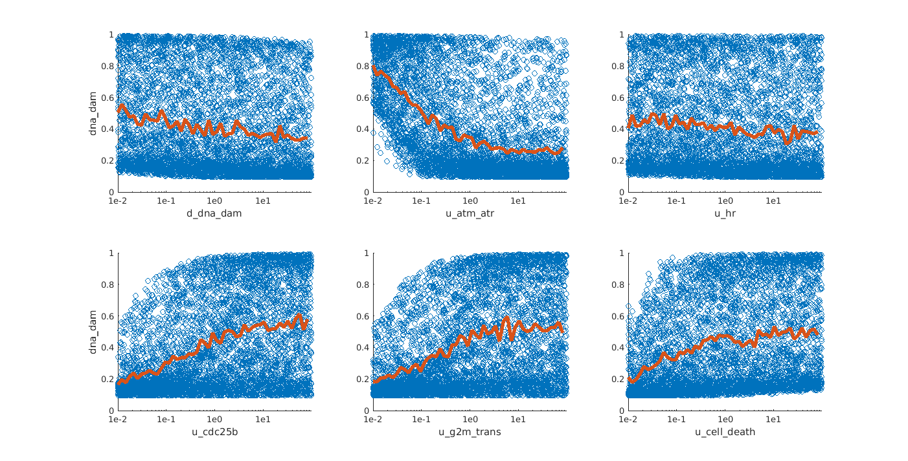

# Exact-stoch-log-mod

Exact calculation of stationary states + parameter analysis & fitting of stochastic logical models

## Table of contents

1. [Requirements](#1-requirements)
1. [Model creation](#2-model-creation)
1. [Calculation of stationary solution](#3-calculation-of-stationary-solution)
1. [Visualizing the stationary solution](#4-visualizing-the-stationary-solution)
1. [Visualizing the state transition graph](#5-visualizing-the-state-transition-graph)
1. [One-dimensional parameter sensitivity analysis](#6-one-dimensional-parameter-sensitivity-analysis)
1. [Multi-dimensional parameter sensitivity analysis](#7-multi-dimensional-parameter-sensitivity-analysis)
1. [Parameter fitting by simulated annealing](#8-parameter-fitting-by-simulated-annealing)

### 1. Prerequisites

##### - MATLAB version 2015b or later

##### - clone the [repository](https://github.com/mbkoltai/exact-stoch-log-mod) and add the folder 'functions' to your path: addpath('functions')

##### - the following freely available MATLAB toolboxes also need to be downloaded and added to the path:

- [Customizable heatmaps](https://mathworks.com/matlabcentral/fileexchange/24253-customizable-heat-maps)  
addpath('heatmaps')

- [Redblue colormap](https://mathworks.com/matlabcentral/fileexchange/25536-red-blue-colormap)  
addpath('redblue');

Optional (for figures with multiple subplots, to save figures and for parameter fitting):  
- [tight subplots](https://mathworks.com/matlabcentral/fileexchange/27991-tight_subplot-nh-nw-gap-marg_h-marg_w) (for subplots with smaller gaps)  
addpath('tight_subplot')

- [export_fig](https://mathworks.com/matlabcentral/fileexchange/23629-export_fig) (export figures as EPS or PDF as they appear)  
addpath('altmany-export_fig-acfd348')

- [Simulated annealing](https://mathworks.com/matlabcentral/fileexchange/10548-general-simulated-annealing-algorithm) (parameter fitting by simulated annealing)  
addpath('anneal')  
To plot the convergence of the fitting process modify the script by 1) defining \<T_loss\> as 3rd output of the function, 2) inserting <counter=0> before the while loop
and 3) inserting <T_loss(counter,:)=[T oldenergy];> at line 175 within the while loop.


### 2. Model creation

Models can be defined by entering the list of nodes and their corresponding rules as a cell of strings, using MATLAB logical notation ('&', '|', '~', '(', ')'), for instance the following is a 10-node model of mitotic entry:  
```MATLAB
nodes = {'cc','kras', 'dna_dam', 'chek1', 'mk2', 'atm_atr', 'hr','cdc25b', 'g2m_trans', 'cell_death'};

rules={'cc',...  
'kras',...  
'(dna_dam | kras) & ~hr',...  
'atm_atr',...  
'atm_atr & kras',...  
'dna_dam',...  
'(atm_atr  | hr) & ~cell_death',...  
'(cc|kras) & (~chek1 & ~mk2) & ~cell_death',...  
'g2m_trans | cdc25b',...  
'cell_death | (dna_dam & g2m_trans)'};  
```


Alternatively, models can be read in in boolnet (.bnet) format by defining the model's path and reading in the boolnet file by the custom function *fcn_bnet_readin*:  
```MATLAB
% name of the model
model_name='mammalian_cc'; % kras15vars

% model read in from an existing BOOLNET file
[nodes,rules]=fcn_bnet_readin('model_files/traynard2016_mammalian_cellcycle.bnet'); krasmodel10vars.bnet
```

Once we have the list of nodes and their logical rules, we can check if all variables referred to by rules are found in the list of nodes:
```MATLAB
fcn_nodes_rules_cmp(nodes,rules)
```

If the BOOLNET file is not consistent in terms of its nodes and rules, this function will display an error message, otherwise prints *Model seems correct: all elements in rules found in nodes list*.

To create the logical model we need to generate a function file:
```MATLAB
truth_table_filename='fcn_truthtable.m';
fcn_write_logicrules(nodes,rules,truth_table_filename)
```
**State transition graph**

From this function file we generate the state transition graph (STG) of the logical model, that is still independent of values of transition rates, it only informs us amongst which states we have possible transitions in the system:
```MATLAB
[stg_table,~,~]=fcn_build_stg_table(truth_table_filename,nodes,'','');
```
This step does not need to be repeated for the further steps, eg. for parameter sensitivity analysis.

Below is the plot for the STG of the aforementioned 10-node model (the function for this plot is described in [Visualizing the state transition graph](#5-visualizing-the-state-transition-graph)):


Since this model has 2 inputs whose state cannot change, its global STG is composed of 4 disconnected subgraphs, one of which is shown on the right.

### 3. Calculation of stationary solution

To calculate the stationary states of a model we need to assign values to the *2xn* (n=number of nodes) transition rates of the model.

We can select a subset of the transition rates to have a specific value by their names, which is always made up of *d_* or *u_* and the name of the respective node, and also define the vector of values we want them to have:
```MATLAB
chosen_rates={'u_cdc25b','d_dna_dam'}; chosen_rates_vals=[0.25, 0.15];
```

Otherwise, if you want all transition rates to have the same value or to be sampled from the same random distribution, leave these variables empty (or don't define them):
```MATLAB
chosen_rates=[]; chosen_rates_vals=[];
```
Call the function to generate the table of transition rates, selecting if you want to have the rates to have a uniform value or to be sampled from a normal distribution, in this case specify the mean and standard distribution:
```MATLAB
% ARGUMENTS
% <uniform> assigns a value of 1 to all params. other option: <random>
distr_type={'uniform','random'};
% if 'random' is chosen, the mean and standard dev of a normal distrib has to be defined
meanval=[]; sd_val=[];
transition_rates_table=fcn_trans_rates_table(nodes,distr_type{1},meanval,sd_val,chosen_rates,chosen_rates_vals);
```
Now we can build the transition matrix of the model with the specified transition rates:
```matlabcentral
[A_sparse,~]=fcn_build_trans_matr(stg_table,transition_rates_table,'');
```

For the subsequent calculations only the transition matrix *A* is needed (it is converted to the kinetic matrix within functions), if you want to have the kinetic matrix *K* as a variable (*dp(t)/dt=Kp(t)*, as opposed to *p(t+1)=p(t)A*), then run the function as:
```MATLAB
[A_sparse,K_sparse]=fcn_build_trans_matr(stg_table,transition_rates_table,'kinetic');
```

**Initial conditions**


### 4. Visualizing the stationary solution

### 5. Visualizing the state transition graph

### 6. One-dimensional parameter sensitivity analysis

### 7. Multi-dimensional parameter sensitivity analysis



### 8. Parameter fitting by simulated annealing
